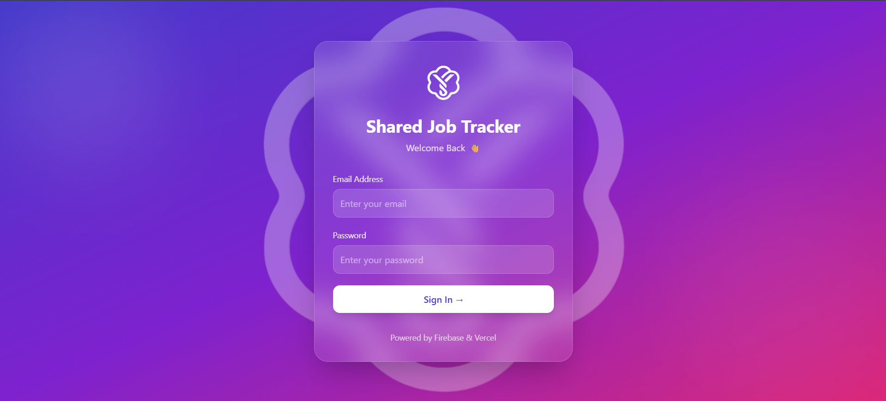
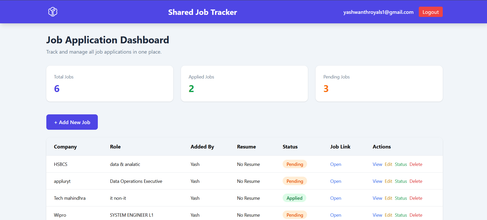
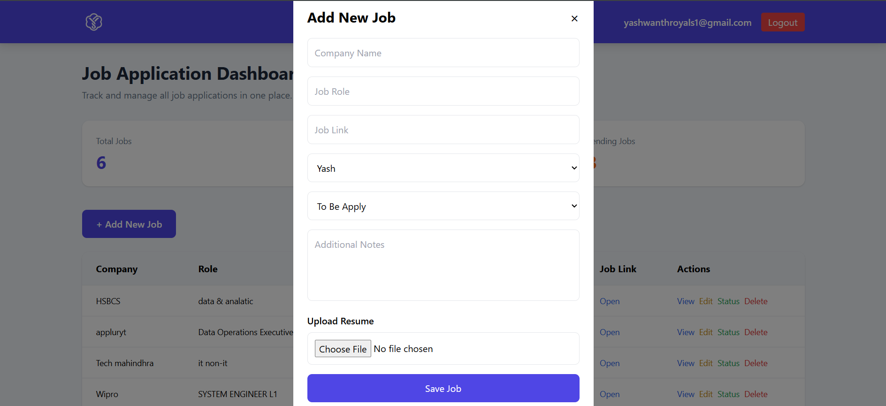

# 🚀 Shared Job Tracker

A modern collaborative Job Application Tracking System built using **HTML, Tailwind CSS, JavaScript, Firebase Authentication, Firebase Firestore, and Vercel**.

The platform helps multiple users track job applications, manage opportunities, monitor application status, and collaborate through a shared dashboard.

## 🌐 Live Demo

https://job-tacker-one.vercel.app/

---

## 📌 Features

### 🔐 Authentication

* Secure Firebase Email & Password Login
* Protected Dashboard Access
* User Session Management
* Logout Functionality

### 📋 Job Management

* Add New Job Applications
* Edit Existing Jobs
* Delete Jobs
* View Detailed Job Information
* Track Job Links
* Store Additional Notes

### 📊 Dashboard

* Total Jobs Counter
* Applied Jobs Counter
* Pending Jobs Counter
* Real-Time Firestore Data

### 👥 Multi-User Support

* Shared Job Database
* Individual User Login
* User-Specific Application Status Tracking

### 🎨 Modern UI

* Responsive Design
* Glassmorphism Login Page
* Gradient Backgrounds
* Mobile Friendly Interface
* Clean Dashboard Layout

---

## 🛠️ Tech Stack

### Frontend

* HTML5
* Tailwind CSS
* JavaScript (ES6+)

### Backend & Database

* Firebase Authentication
* Firebase Firestore

### Deployment

* Vercel

---

## 📂 Project Structure

```text
Shared-Job-Tracker/
│
├── index.html
├── login.html
├── app.js
├── login.js
├── firebase.js
│
├── Assets/
│   ├── icon-1main.png
│
└── README.md
```

## 🔥 Firebase Services Used

### Firebase Authentication

Used for:

* User Login
* User Session Management
* Dashboard Protection

### Firebase Firestore

Used for:

* Storing Job Applications
* Updating Job Status
* Managing Shared Data
* Real-Time Data Persistence

---

## 🚀 Installation

Clone the repository:

```bash
git clone https://github.com/yashs1211/YOUR-REPOSITORY-NAME.git
```

Navigate to the project folder:

```bash
cd YOUR-REPOSITORY-NAME
```

Open with Live Server or deploy using Vercel.

---

## 📸 Screenshots

### 🔐 Login Page



---

### 📊 Dashboard



---

### ➕ Add Job Modal


---

## 🎯 Future Enhancements

* Firebase Storage for Resume Uploads
* Search Functionality
* Job Filtering
* Advanced Analytics Dashboard
* Dark Mode
* Notifications & Reminders

---

## 👨‍💻 Developed By

**Yashwanth & sucharitha**

GitHub:
https://github.com/yashs1211

---

## 📜 License

This project is developed for educational, learning, and portfolio purposes.
